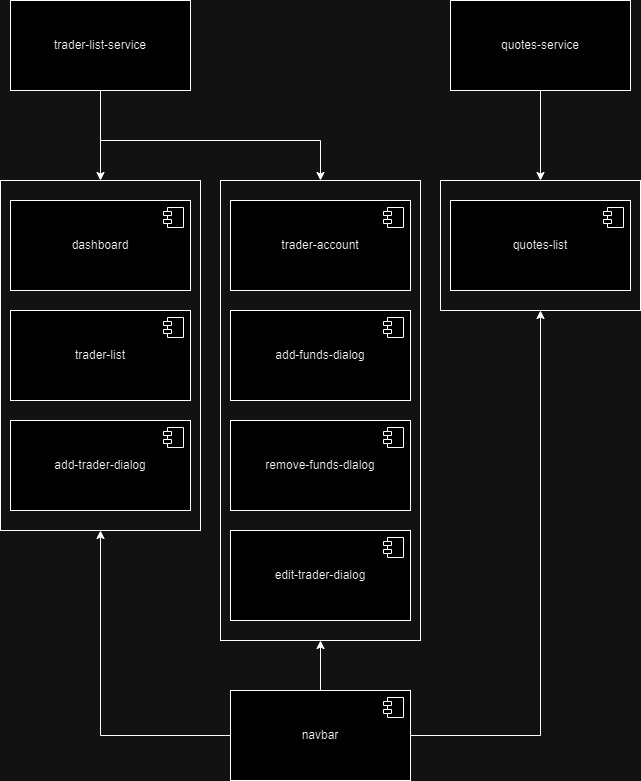

# Introduction
The Angular Trading App is a web application that allows users to create, edit, delete, and view traders. It also allows users to deposit or withdraw funds from a trader's account. Users are also able to access a 'Quote' page which will display stock quote data pulled from the Alpha Vantage API. The application was built using Angular, Angular Material, and Node.js. HTTPClient was used to access the Alpha Vantage API and utilize the returned observable with Angular Material tables to display the results. Docker was used to create and upload an image to Dockerhub for users to easily access. Git and GitHub were used for version control through the GitFlow branching model.

# Quick Start
After you have downloaded the Docker image, input the following command:
```
docker run -d -it -p 80:80/tcp --name angular-trading-app ilyasismaiil/angular-trading-app:latest
```

Once that is complete, the web applcation will be running on port 80 and will be accessible through this link: localhost:80.

# Implementation
The program will open the user onto a list of pre-created traders. From there, the user can either delete or view the traders through a button click, or create a new trader with a button at the top of the table. If the user decides to create a new trader, a dialog box will pop up, prompting the user to input the necessary fields. Once created, the user will be dynamically added to the trader table. When the user clicks the view button, they will be transferred to the trader's account page. The trader's account page has the added information of the account's amount, the user can also withdraw, deposit, or edit the trader's information through the click of a button which will open a new dialog box. Users can also access a 'Quote' page, the page displays stock quote data pulled from the Alpha Vantage API.

## Architecture

<br>The architecture design above displays which components are working together and which services are being used.

# Test
The application was testing during development through the use of ng serve. As the project's features were being implemented, the web application was being refreshed and tested to ensure each feature worked as intended.

# Deployment
The application was deployed through Dockerhub. A Dockerfile was created to store the application inside of a docker image, which was uploaded to Dockerhub. The source code was deployed onto GitHub using Git.

# Improvements
- handle Quote adding/removing
- handle data verification
- add user system
