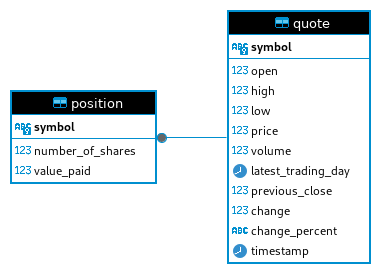

# Introduction
The Stock Quote App is a Java application that mimics the process of buying and selling real stocks based on their current statistics, which is obtained through the Alpha Vantage API. This application was built using Core Java, utilizing JDBC to connect to and perform queries on a PostgreSQL database. Maven was used to build and package the application, and to obtain packages such as Mockito, JUnit, and SLF4J to log and test the application. OkHTTP was used to retrieve stock quote information from the Alpha Vantage API. Docker was used to create and upload an image to Docker Hub for users to easily access.

# Quick Start
Once you've downloaded the Docker image, input the command:     docker run --ulimit nofile=65536:65536 --net=host -it --rm -v {absolute_properties_path} ilyasismaiil/jdbc {relative_properties_path}      The properites.txt file must consist of the following properties:

- db-class:org.postgesql.Driver
- server:{serverName}
- database:{databaseName}
- port:{portNumber}
- username:{databaseUsername}
- password:{databasePassword}
- api-key:{alphaVantageAPIKey}

# Implementation
The program will display a console UI, allowing the user to input a number between 0-3. Depending on the user's input, they will be able to view and purchase a stock based on the given symbol. They may also view and compare their stock with the current value versus the purchased value, then sell if they wish to. The third option allows them to view all their owned stocks. The fourth and last option will allow them to exit the application.
## ER Diagram

## Design Patterns
This application consists of one DAO interface, three DAOs and two services.

### DAOs
- QuoteHTTPHelper: Has one method, fetchQuoteInfo, which will send a request to the Alpha Vantage API to retrieve information for a specific stock. Once it receives the JSON object, it will transform it into a Quote object using Jackson.
- QuoteDao and PositionDao: They both extend from CrudDao. They each implement five method, the methods are used to insert, retrieve, update, or delete objects to and from the database.

### Services
- QuoteService: Consists of one method, fetchQuoteDataFromAPI, it will call on QuoteDao's save method and QuoteHTTPHelper's fetchQuoteInfo method to find data on a specific quote, then save it to the database.
- PositionService: Consists of two methods, buy and sell. The first method, buy, will call on PositionDao's save method and QuoteHTTPHelper's fetchQuoteInfo method to check if there are enough stocks for the user to purchase, then calculate the value of the stocks by multiplying the quantity by the price, and finally creating and saving a Position object to the database. The second method, sell, will sell (delete) the user's specified stocks from the database.

# Test
The application was tested through unit, integration, and manual testing. Unit testing was done to ensure each component from the service class worked on its own. Integration testing was done to ensure the methods worked end-to-end, including accessing the database and receiving proper return values from methods that relied on it. Manual testing was done on the controller to confirm the UI works as intended.

