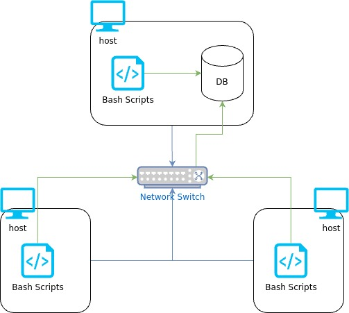

# Linux Cluster Monitoring Agent
# Introduction
The Linux Cluster Monitoring Agent is a script with the purpose of recording system specifications and resource usage. The goal is to help system administrators keep track of system performance in order to efficiently replace faulty hardware. Technologies such as Docker and PostgreSQL are being used to host and store data. Meanwhile, Bash is used to obtain system specifications and resource usage over time. Lastly, Git and GitHub are being used for version management.

# Quick Start
- Start a PostgreSQL instance using psql_docker.sh
- Create tables using ddl.sql
- Insert hardware specs data into the DB using host_info.sh
- Insert hardware usage data into the DB using host_usage.sh
- Crontab set-up

# Implementation
The implementation of the project was initiated with the creation of the PostgreSQL docker container that is used to host the database. It was then followed up by creating a database and its tables and schemas that would be used to store all the data from the scripts. Once the database was established, two scripts were implemented, host_info.sh and host_usage.sh. The host_info.sh script would store the system specifications for a system so long as it has not been entered before. The host_usage.sh script would store the resource usage of the system at the current time. Lastly, a crontab task was set up to automatically run the host_usage.sh script every minute to keep track of the changes over time.
## Architecture

The architecture design above displays that each host connects to the network switch and sends over the data produced from the scripts to the host with the database to enter the information in the respective tables.

## Scripts
- psql_docker.sh (create, start, or stop a container)
```
Script usage.
./scripts/psql_docker.sh start|stop|create [db_username] [db_password]

Create a psql docker container with the provided username and password so long as it does not exist.
./scripts/psql_docker.sh create db_username db_password

Start the container if it exists.
./scripts/psql_docker.sh start

Stop the running container if it exists.
./scripts/psql_docker.sh stop
```
- ddl.sql (create "host_info" and "host_usage" tables if they do not exist inside the "host_agent" database.)
```
Script usage. 
psql -h localhost -U postgres -d host_agent -f sql/ddl.sql
```
- host_info.sh (insert system specifications into "host_info" table if hostname is unique.)
```
Script usage.
./scripts/host_info.sh psql_host psql_port db_name psql_user psql_password
```
- host_usage.sh (insert resource usage into "host_usage" table)
```
Script usage.
bash scripts/host_usage.sh psql_host psql_port db_name psql_user psql_password
```
- crontab (automatically run host_usage.sh every minute.)
```
Script usage. Make sure to use the correct full file path for the host_usage.sh script.
* * * * * bash /FILEPATH/host_usage.sh localhost 5432 host_agent postgres password > /tmp/host_usage.log
```
## Database Modeling
- The "host_info" table contains system specifications of unique hosts.
```
id: The primary key. It's an auto-incremented unique id for each entry.
hostname: The full name of the host system.
cpu_number: The number of CPUs present in the system.
cpu_architecture: The architecture of the CPU, stating whether it is x86,x64,etc.
cpu_mhz: The megahertz of the CPU, its clock speed.
l2_cache: Size of frequently used data and instructions.
timestamp: UTC timestamp of when the entry was made.
```
- The "host_usage" table contains the resource usage of the system, the information is collected and stored every minute.
```
timestamp: UTC timestamp of when the entry was made.
host_id: The "id" value of the system retrieved from the "host_info" table based on the host name.
memory_free: The current amount of available memory.
cpu_idle: The percent of the CPU that is idle.
cpu_kernel: The percent of the CPU that is being used for the kernel.
disk_io: The size of input and output currently in progress.
disk_available: The amount of disk space available on the system.
```
# Test
Testing was done on a single machine through running each script once an edit was complete and debugging it based on errors received. As this was a smaller project, the error messages were sufficient to help solve the few errors that popped up.
# Deployment
The database was deployed through Docker using the PostgreSQL image. The automation was deployed through a crontab task that is set to run the "host_usage.sh" script every minute. Lastly, the code was deployed to a cloud repository using Git and GitHub.

# Improvements
- Add a script to find the area of time when resources are being used the most.
- Compare system specifications every set amount of time with the one in the database, and update it if necessary.
- Remove entries after a certain amount of time has passed.