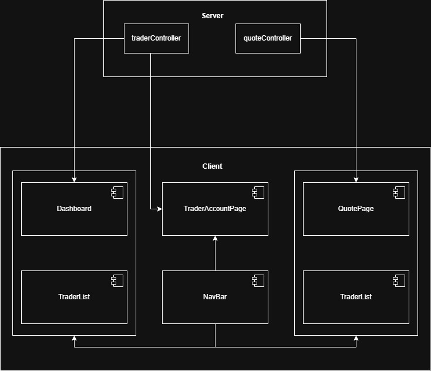

# Introduction
The React Trading App is a RESTful web application built using Node.js, Express.js, React.js, MongoDB, and Ant Design. The application allows users to create, view, update, and delete traders. Users can also view stock quote data in a list on a separate page. While viewing the list of traders, users can select a trader to get a more in-depth view at their account and withdraw or deposit funds into their balance. Axios was used to make calls to the back-end API, where it called upon the CRUD methods for the corresponding request. Git and GitHub were used for version control through the GitFlow branching model.

# Quick Start
- Download the source code from GitHub
- Install MongoDB and create a database with two tables, traders and quotes
- Open the db.js file inside the server folder and replace the "URI" string with your database connection string
- Install node & npm
- Run ```npm install``` and ```npm start``` inside the server folder and the trading-ui folder

# Implemenation
Once the application is launched, the user will be directed to a page displaying all the traders. The user can then view the traders, add a trader through the button at the top, or delete traders by clicking on the trash can icon. If the user wants to see a more in-depth view at a trader, they can click on the magnifying glass icon to view the trader's account details. While view the trader's account details, the user can withdraw or deposit funds by clicking on the corresponding buttons. If the user tries to add a trader, a dialog box will pop up, requiring the user to insert the appropriate contents inside each field. After the user submits the trader, they will be added to the database and will dynamically update the trader list to include themself. Users can also access a "Quotes" page to view all the quotes available inside the database.

## Architecture

<br>The architecture design above displays which components are working together and which services are being used.

# Test
The application was manually tested. Each time the back-end or front-end was updated, the feature was tested to ensure everything was working as intended.

# Deployment
The application was deployed to GitHub using Git.

# Improvements
- pull quote data from another API
- add a search feature
- add a user system with different levels of access