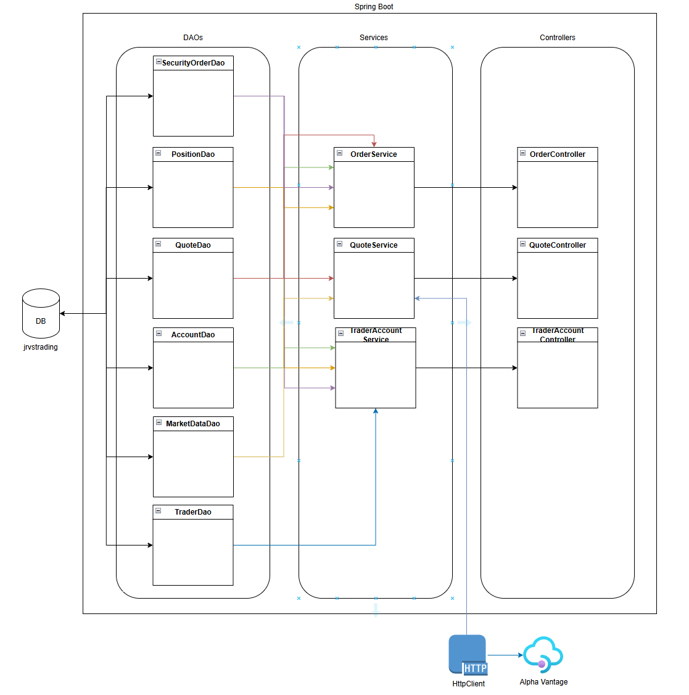
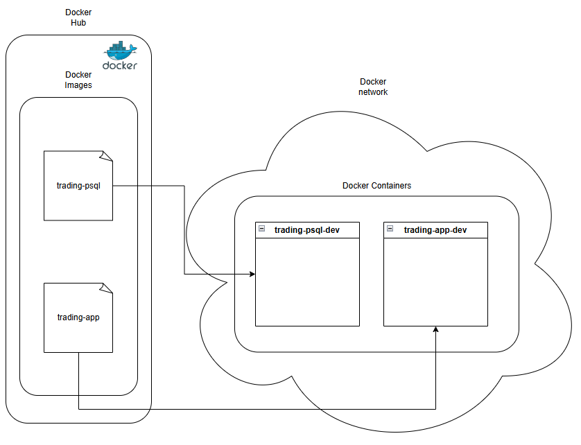

Table of contents
* [Introduction](#Introduction)
* include all first level titles

# Introduction
- The Spring Boot Trading App is a microservice orientated Spring Boot application that consumes data from a RESTful Alpha Vantage API to get the most up to date stock data. The application also has a variety of other features, such as: managing trader accounts and profiles, purchasing and selling stocks, and viewing all owned stocks. Various technologies were used in the development of this application. PostgreSQL was used as the database for this project. HttpClient and Jackson were used to recieve data from the API and parse it into a Java object. Docker, Maven, and Git were used for version control and application deployment.

# Quick Start
- Prequiresites: Docker, CentOS 7
- Docker set-up
  - create a docker network: sudo docker network create trading-net
  - build the database docker image inside springboot\psql: docker build -t trading-psql .
  - build the application docker image inside the main folder: docker build -t trading-app .
  - for the database container: docker run --name trading-psql-dev -e POSTGRES_PASSWORD=password -e POSTGRES_DB=jrvstrading -e POSTGRES_USER=postgres --network trading-net -d -p 5432:5432 trading-psql
  - for the application container: docker run --name trading-app-dev -e "PSQL_URL=jdbc:postgresql://trading-psql-dev:5432/jrvstrading" -e "PSQL_USER=postgres" -e "PSQL_PASSWORD=password" --network trading-net -p 5000:5000 -t trading-app
- Non-Docker set-up
  - create a database named jrvstrading inside postgres
  - run the script inside springboot\psql into the jrvstrading database
  - open TradingApplication.java inside springboot\src\main\java\com\jrvs\trading
  - run the application
- Try the trading-app with Postman.

# Implemenation
## Architecture
- 
  - Controller layer: Handles user requests and sets the mapping of endpoints for users to access. Interacts with the service layers, sending the user inputs and requests to complete the tasks needed.
  - Service layer: Handles the business logic of the application. Interacts with the Alpha Vantage API and maps the JSON into a POJO. Communicates with the DAOs to pull the data needed.
  - DAO layer: Handles the communication between the database and Spring Boot. Allows for custom queries, making the code more readable and increases the ease of accessing data. Comes with a variety of pre-existing queries, such as staple CRUD queries.
  - SpringBoot: webservlet/TomCat and IoC
  - PSQL and Alpha Vantage: PostgreSQL stores all the data needed for the application. Alpha Vantage provides the application with the stock data it needs. Alpha Vantage data is stored inside the PostgreSQL database and pulled to the Spring Boot application whenever needed.

## REST API Usage
### Postman
Postman is a tool to interact with APIs. It is a simple and fast way to test each endpoint listed below.
### Quote Controller
- The quote controller interacts with the quote service to allow the user to interact with and view quote data. The quote data is pulled from an Alpha Vantage RESTful API, it is then stored inside of a PostgreSQL database. Using the quote controller, users can get any quote they want, update quotes directly from Alpha Vantage, create custom quotes, and view a list of quotes.High-level description for this controller. Where is market data coming from (IEX) and how did you cache the quote data (PSQL). Briefly talk about data from within your app
- GET `/quote/vantage/ticker/{ticker}`: get the quote data of the provided ticker
- GET `/quote/vantage/tickers`: update all the current quotes
- PUT `/quote`: create a custom quote
- POST `/quote/vantage/ticker/{ticker}`: get the quote data of the provided ticker and save to the database
- GET `/quote/vantage/dailyList`: get all the quotes in the database
### Trader Controller
- The trader controller handles the managing of trader and account information. It allows users to create traders and accounts, delete them, or withdraw and deposit to their balances.
- POST `/trader/firstname/{firstname}/lastname/{lastname}/dob/{dob}/country/{country}/email/{email}`: create a trader with the provided parameters
- POST `/trader`: alternative method to create a trader directly with a Trader object
- DELETE `/trader/traderId/{traderId}`: remove a trader and their associated account based on the given traderId
- PUT `/trader/deposit/traderId/{traderId}/amount/{amount}`: deposit a provided amount of currency into the provided traderId
- PUT `/trader/withdraw/traderId/{traderId}/amount/{amount}`: withdraw a provided amount of currency into the provided traderId
### Order Controller
- The order controller handles the purchasing and selling of stocks.
- POST `/order/marketOrder`: create a security order based on the provided MarketOrder object

# Test 
The application was manually tested, each end-point was tested for success and fail cases.

# Deployment

e.g. https://www.notion.so/jarviscanada/Dockerize-Trading-App-fc8c8f4167ad46089099fd0d31e3855d#6f8912f9438e4e61b91fe57f8ef896e0
- The trading-psql-dev container is responsible for hosting the database that will be used by the application. On initiation, trading-psql-dev will create the requried database and tables if they are not present. It will create a database named "jrvstrading" and five tables and views with their required fields: trader, account, quote, security_order, and position.
- The trading-app-dev container holds the Spring Boot Trading App. The trading-psql-dev container must be online for this container to run, the application will not start without a functioning database with the required database and tables, forcing it to shutdown immediately.

# Improvements
If you have more time, what would you improve?
- at least 3 improvements